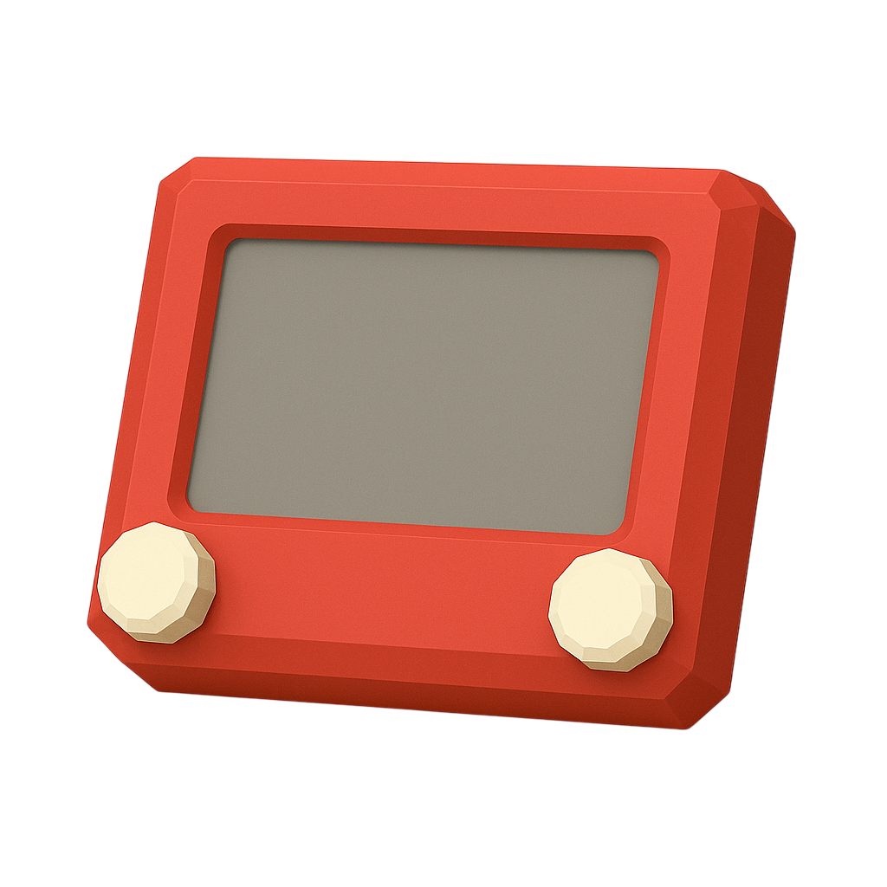
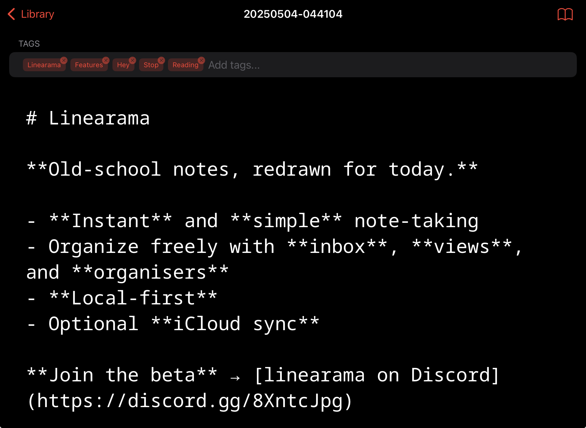
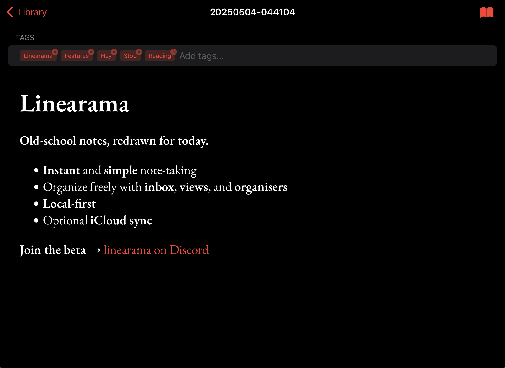
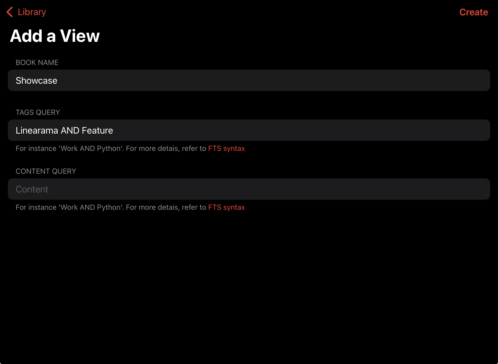

  

# Linearama

> 📝 Old-school notes, redrawn for today.

Linearama is a local-first, skeuomorphic note-taking app designed for fast capture, flexible organization, and seamless search. It supports both text and handwritten notes, hierarchical books (folders), and optional iCloud synchronization.

---

## 🧭 Table of Contents

- [🚀 Get Started](#-get-started)
- [🖼️ Screenshots](#️-screenshots)
- [✨ Features](#-features)
- [🧱 Core Concepts](#-core-concepts)

---

## 🚀 Get Started

- 🌐 [Visit Website](https://linearama.app)
- 📱 [Join Beta (TestFlight)](https://testflight.apple.com/join/KSsARdDa)
- 💬 [Join Discussions](https://github.com/linearama/linearama/discussions)

---

## 🖼️ Screenshots

  
  
  
  
  

---

## ✨ Features

- ⚡ **Instant note capture**: Create text or scribble notes with two taps.
- 💾 **Local-first**: All notes are stored on your device by default.
- ☁️ **Optional iCloud sync**: Enable iCloud to sync notes across devices.
- 📁 **Hierarchical organization**: Organise notes in books.
- 🔍 **Smart views**: Create dynamic views that filter notes by tags or content.
- 🧠 **Full-text search**: Instantly search all notes by content or tags.
- 🏷️ **Tagging**: Add, remove, and search by tags.
- 🗓️ **Custom date formats**: Choose how note names are generated.
- 🗑️ **Recycle Bin**: (Planned) Recover deleted notes.

---

## 🧱 Core Concepts

### 📝 Note
A single piece of information, either text or scribble.

### 📁 Organiser
A folder that groups together Views or other Organisers.

### 🔍 View
A smart folder that shows notes matching specific tag/content queries.

### 🏷️ Tag
A label you can attach to notes for organization and search.

---

### 🗂️ Library

- The root of your note collection.
- Shows all top-level books and notes.
- Toolbar:
  - **Logo**: App branding.
  - **Settings**: Access app settings.
  - **Search**: Search all notes.
  - **+**: Add new note or book.

---

### 🖊️ Text Notes

- Markdown-enabled text notes.
- **Edit**: Type in the editor.
- **Preview**: Tap the book icon to toggle Markdown preview.
- **Auto-save**: Changes are saved automatically.

---

### ✍️ Scribble Notes

- Handwritten notes using Apple Pencil or touch.
- **Tools**: Pen, marker, eraser, ruler, lasso.
- **A4 grid paper**: Realistic background for writing.
- **Auto-save**: Drawings are saved as you write.

---
